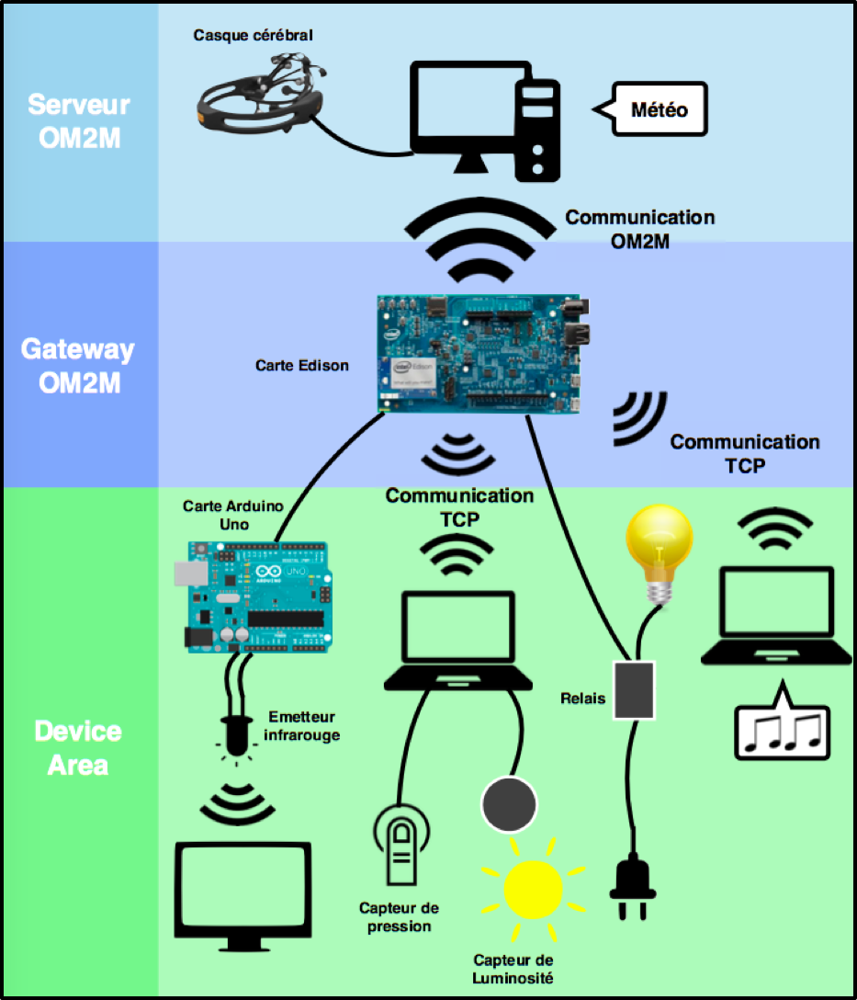

# La maison inteligente

L’objectif principal de ce projet était de rendre une maison plus intelligente par le biais d'objets connectés. Dans un premier temps, nous nous sommes dirigés vers une maison intelligente au service de personnes touchées par un handicap. Puis nous avons étendu nos fonctionnalité à une utilisation quotidienne pour faciliter la vie de toutes personnes utilisant notre système.

**Fonctionnalités implémentées**
- Allumer/éteindre des appareils électroniques de la maison à partir de la reconnaissance faciale d'un casque cérébral (lorsqu'un utilisateur serre les dents).
- Commander une télévision (changer les chaînes et le volume) en faisant des mouvements de tête grâce au gyroscope d'un casque cérébral. 
    - mouvement vers le haut : volume +
    - mouvement vers le bas : volume -
    - mouvement vers la droite : programme +
    - mouvement vers la gauche : programme -
- Allumage d'une bande de LEDs de façon progressive pour un reveil en douceur. Par le biais d’un capteur de luminosité, nous allons détecter lorsque la bande de LEDs émet à pleine puissance et la météo actuelle sera enoncé. 
- Utilisation un capteur de pression qui détecte lorsqu'une personne s'assied. De la musique est alors lancé sur un ordinateur de la maison.

**Outils et capteurs utilisés**
- Projet Eclipse open source OM2M developpé par le LAAS/CNRS pour instancier les standards OneM2M permettant de faire communiquer nos appreils connectés dans l'internet et intéragir avec eux. (Lien du projet OM2M : http://www.eclipse.org/om2m/)
- Casque cérébral Emotiv équipé d'électrodes et d'un gyroscope.
- API Emotiv pour pouvoir interagir avec le casque cérébral 
- Carte Edison d'Intel comme gateway OM2M
- Carte Arduino
- Emetteur infrarouge grove pour le commande de la télévision
- Capteur phidget de pression et de luminosité
- Relais grove pour allumer/éteindre tous appareils electronique reliés à une ralonge spécifique.
- API iTunes pour jouer de la musique lorsqu'un utilisateur s'assied

**Architecture réalisée**

